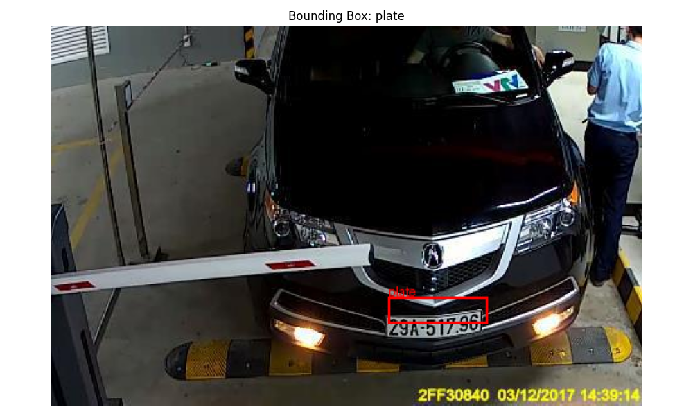
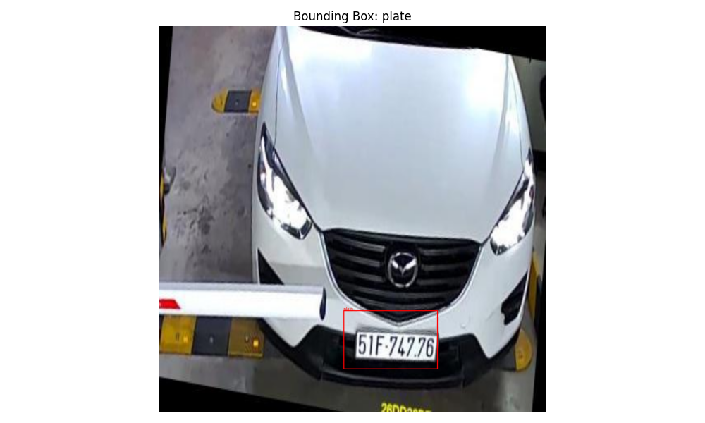
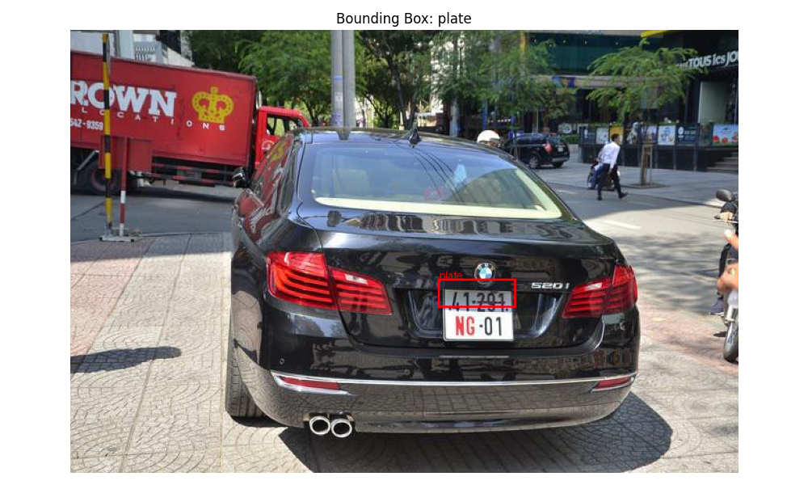
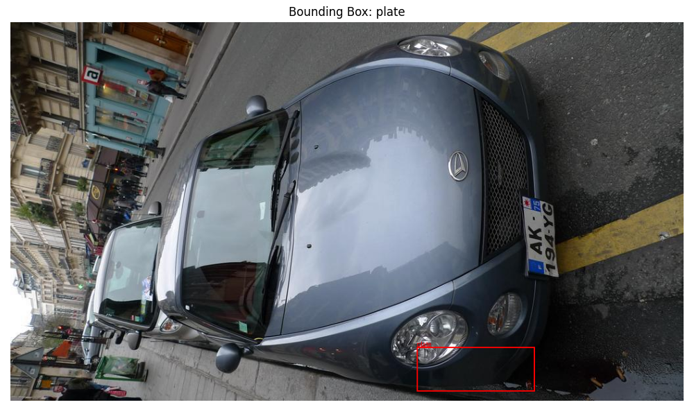
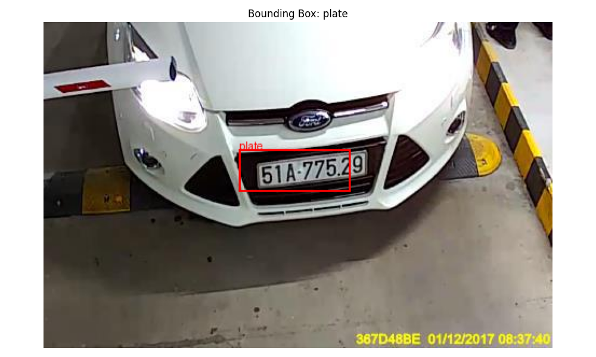
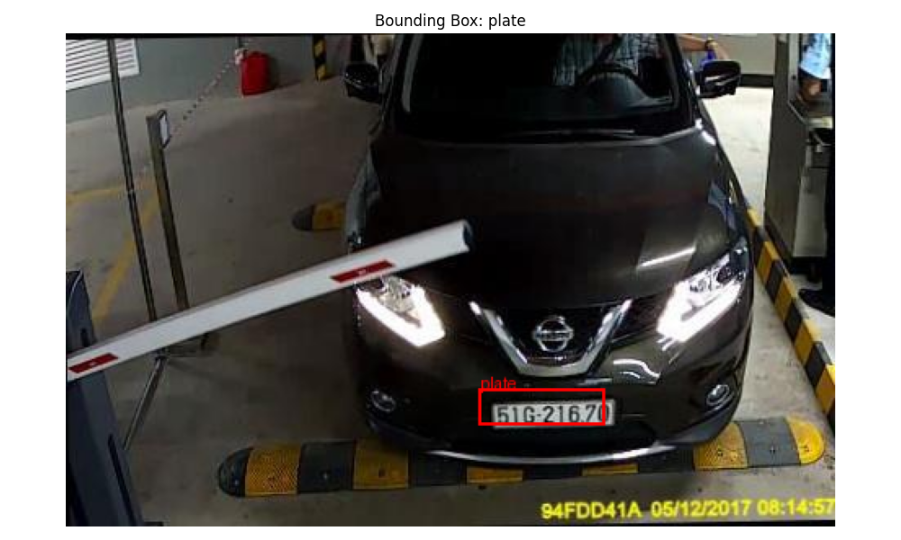
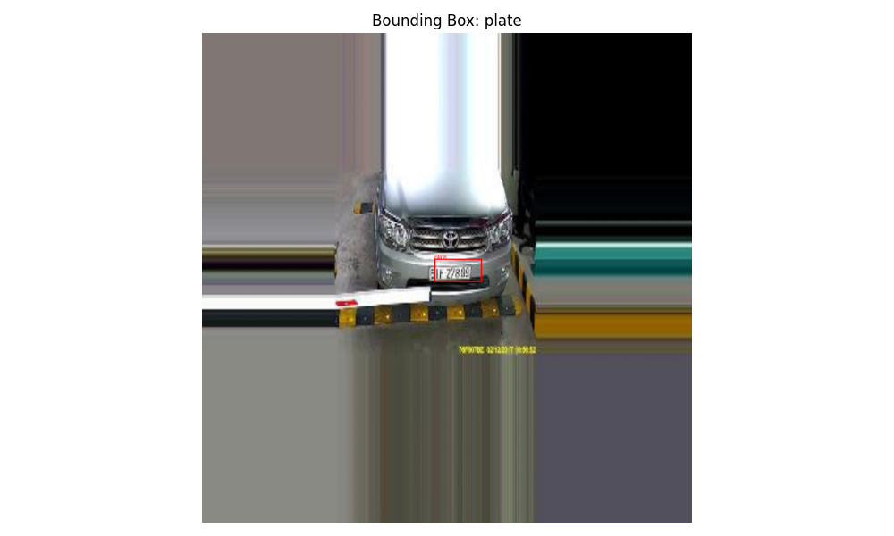
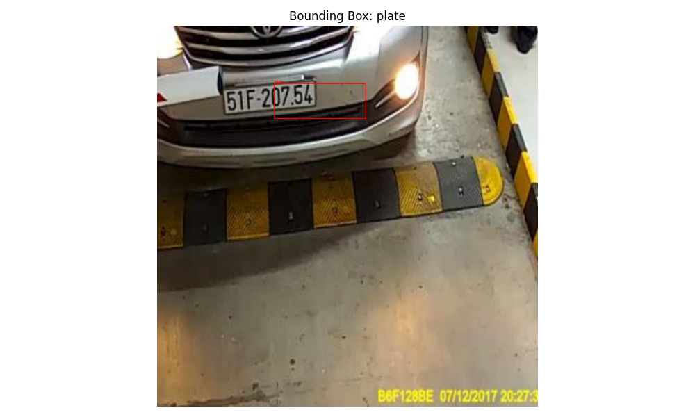

# Object Detection with Gemma 3

This project is an experiment to see whether we can fine tune Gemma 3 (a natively multimodal model)
to detection objects in an image. Note that Gemma 3 was not trained on the object detection task. We
try to utilize its native multimodal capabilities and make it learn a new task in the fine tuning
phase.

## Results

| Boxes |
| :--: |
|  |
|  |
|  |
|  |
|  |
|  |
|  |
|  |